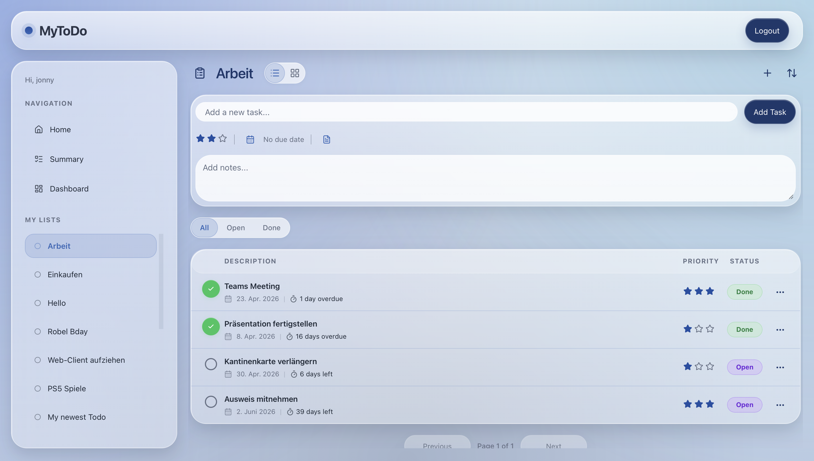
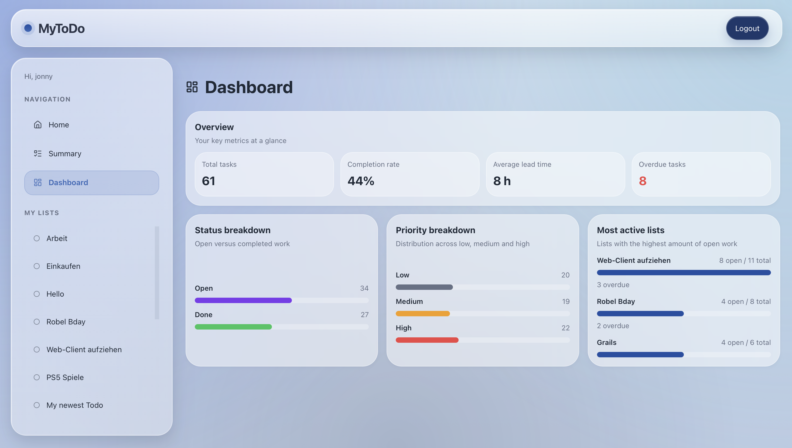

# MyToDo

MyToDo is a full-stack task management application built as a personal software engineering project.
It combines a FastAPI backend with a React frontend and focuses on clean architecture, practical usability, and iterative product development.

## Features

- User login and registration
- To-Do list overview
- Task creation, editing, sorting, and deletion
- List and grid views for task details
- Dashboard with key productivity metrics
- Session and navigation persistence
- Local file-based persistence

## Tech Stack

- **Backend:** FastAPI, Pydantic
- **Frontend:** React, Vite
- **Data handling:** pandas
- **Tooling:** pytest, pre-commit, black

## Project Structure

```bash
mytodo/
  clients/
    api/
    web/
    cli/
  core/
  domain/
  infra/
docs/
tests/
```

- **domain** contains the core business objects and rules
- **core** contains services, protocols, and application logic
- **infra** contains repository and adapter implementations
- **clients** contains the API, frontend, and CLI layers

## Getting started

**1. Create and active a virtual environment**

```bash
/opt/homebrew/bin/python3.13 -m venv .venv
source .venv/bin/activate
```

**2. Install dependencies**

```bash
python -m pip install -r requirements-dev.txt
```

**3. Start the backend**

```bash
python -m uvicorn mytodo.clients.api.app:app --reload
```

**4. Start the frontend**

```bash
cd mytodo/clients/web
npm install
npm run dev
```

## Testing

Run backend tests with:

```bash
pytest -v
```

Run formatting and pre-commit checks with:

```bash
pre-commit run --all-files
```

## Current Status

This project is currently being prepared for the **v0.1.0** release.
The focus of this release is a stable local development setup, a working frontend and backend flow, and a clean project foundation for future improvements.

## Roadmap

Planned next steps include:

- Docker setup for frontend and backend
- Improved documentation
- Further UI/UX refinements
- Future persistence and deployment improvements

## Screenshots

### To-Do-Detail List View



### Dashboard


